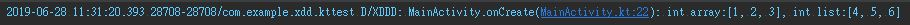
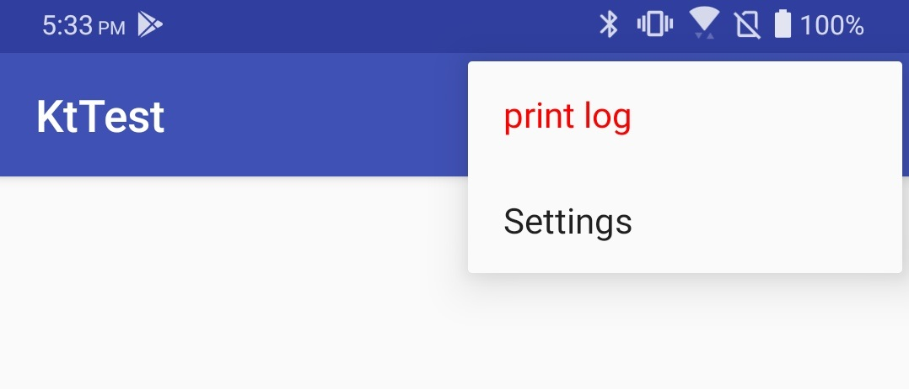
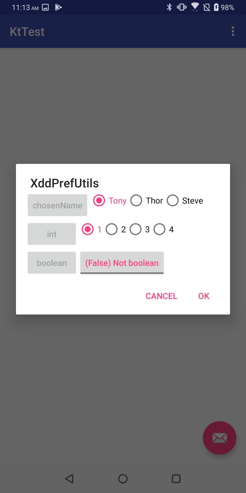

# XDDLib
Enhanced log and other utilities for android programming

## Enhanced Log function
- Like enhanced `StringBuilder`
- Extracted stack trace element: just **one click to navigate** to where the log command is
  - `Lg.d("int array:", intArrayOf(1, 2, 3), "int list:", listOf(4, 5, 6))`
  - 
- Handled native int/char/byte... array (won't printed as hashcode)
- Handle log content with tremendous size (traditional `Log.D(TAG, content)` will truncate overflow string directly)
  - 
- Programmable log type
  - `Lg.log(if (isSerious) Lg.Type.E else Lg.Type.W, "The severity of this problem is $isSerious")`
  
  
## XddMenu
- Simple `Menu` UI that can easily be embedded into existing project
- Usages
  - Inherit `XddActivity` or copy those code to your existing `Activity`
  - `activity.xddMenuManager.addAction("print log", Runnable { Lg.v() })`
    - 
 
## XddPref
- Preference data integrated with the above `XddMenu`
- Usages
  - 
  ```
  private val chosenName = XddPrefEnumData(this/*context*/, "chosenName", "Tony", "Thor", "Steve")
  private val int = XddPrefEnumData(this/*context*/, "int", 1, 2, 3, 4)
  private val boolean = XddPrefBinaryData(this/*context*/, "boolean")
  
  // in other place
  if (boolean.get()) {
    Lg.v("int:${int.get()}", "chosenName:${chosenName.get()}")
  }
  ```
  - 
 
